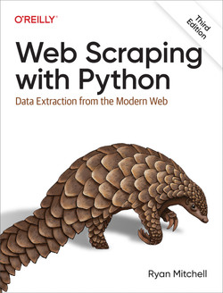

# Web-Scraping-with-Python

This will be my walk through of the book [Web Scraping with Python](https://github.com/REMitchell/python-scraping) by Ryan Mitchell.

## Saturday, November 23, 2024

 1) mamba create -n ws python=3.11
 2) mamba activate ws
 3) mamba install conda-forge::jupyterlab
 4) mamba install conda-forge::beautifulsoup4
 5) mamba install conda-forge::lxml
 6) mamba install conda-forge::scrapy
 7) mamba install conda-forge::selenium

 
